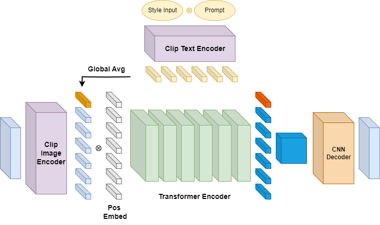

# Applied CV Final Project: Group 11
# Unsupervise Text to Image Style Transfer with Transformer
*Authors: Zongyu Chen, Cheng-Yu Liu, Jonathan Cappell

This projected is based on two paper, [SyTr^2 : Image Style Transfer with Transformers](https://arxiv.org/abs/2105.14576) and [CLIPstyler](https://arxiv.org/abs/2112.00374). This project proposes a unsupervise framework for implementing text to image style transfer using a transformer model and CLIP embedding.

## Model Architecture and Framework
<p align="center">

</p>
The overall pipline of our model. First, we utilize CLIP to encode the content image and style text into tokens. A learnable position are applied to these tokens before they are fed into our encoder model, where self-attention between image tokens and style tokens is performed. The resulting output image tokens are concatenated into a tensor and passed through a CNN with transpose convolution for additional upsampling. Notably, the CLIP model remains frozen during the entire training process. <br>


## Experiment
### Requirements
* python 3.9
* pytorch 2.0.0
* torchvision 0.15.1
* transformers 4.28.1
* PIL, numpy, scipy
* [CLIP](https://github.com/openai/CLIP)
* tqdm  <br> 

### Training Configuration and Execution
Training can be initiated by running <br>  
```
./bin/train.sh
```
The train.sh file contains all the necessary arguments and training parameter options needed to configure and execute the model's training process.
